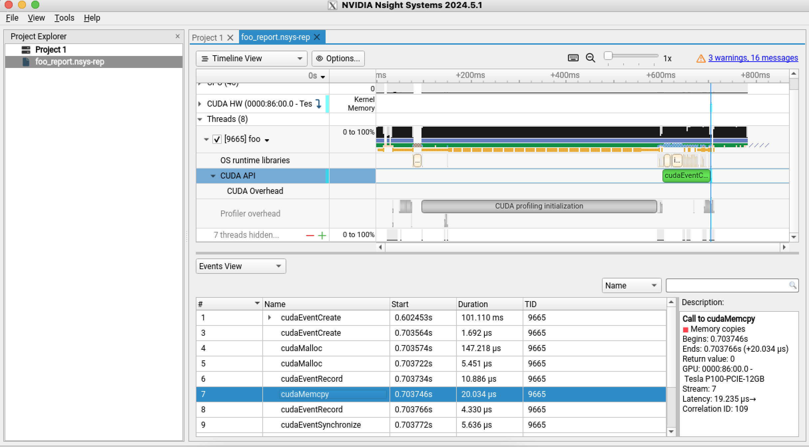
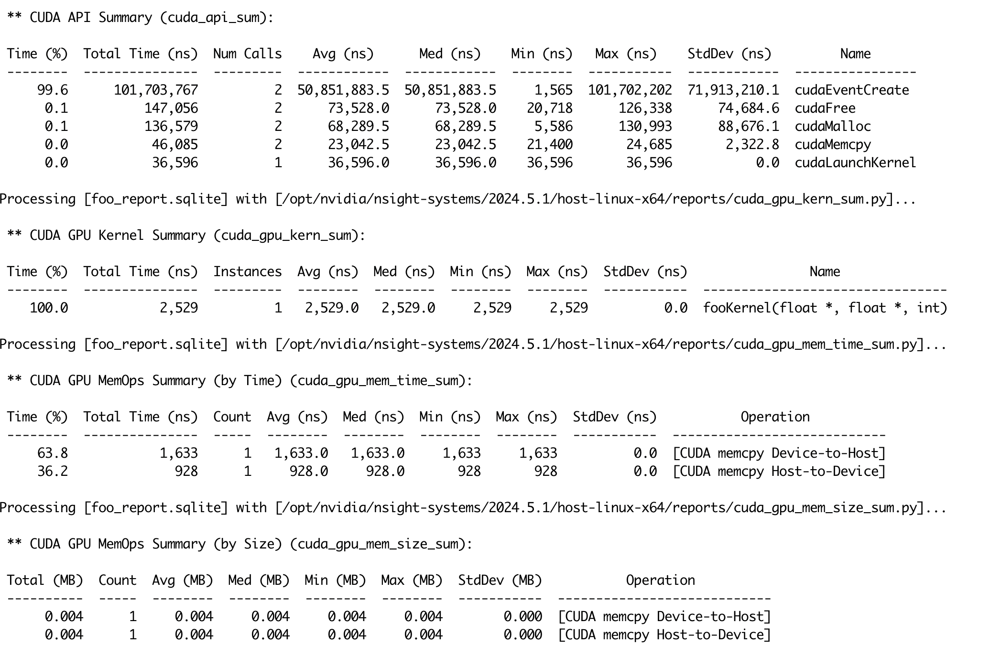

# Nsight Systems
go to https://developer.nvidia.com/nsight-systems/get-started
```
wget https://developer.nvidia.com/downloads/assets/tools/secure/nsight-systems/2024_5/NsightSystems-linux-public-2024.5.1.113-3461954.run
chmod +x NsightSystems-linux-public-2024.5.1.113-3461954.run
sudo ./NsightSystems-linux-public-2024.5.1.113-3461954.run
```
To uninstall the Nsight Systems 2024.5.1, please delete "/opt/nvidia/nsight-systems/2024.5.1"
```
export PATH=/opt/nvidia/nsight-systems/2024.5.1/bin:$PATH
nsys profile -o foo_report foo
```
Open nsys-ui
```
glxinfo | grep "OpenGL version"
sudo update-alternatives --config glx
export XDG_RUNTIME_DIR="/run/user/$(id -u)"
nsys-ui
```
Open foo_report.nsys-rep, go to CUDA API, check Events View, cudaMemcpy = 20.034 μs.
When use cudaEventElapsedTime, elapsedTime = 0.025312 ms

'''
nsys stats foo_report.nsys-rep
'''

# Nsight Compute
